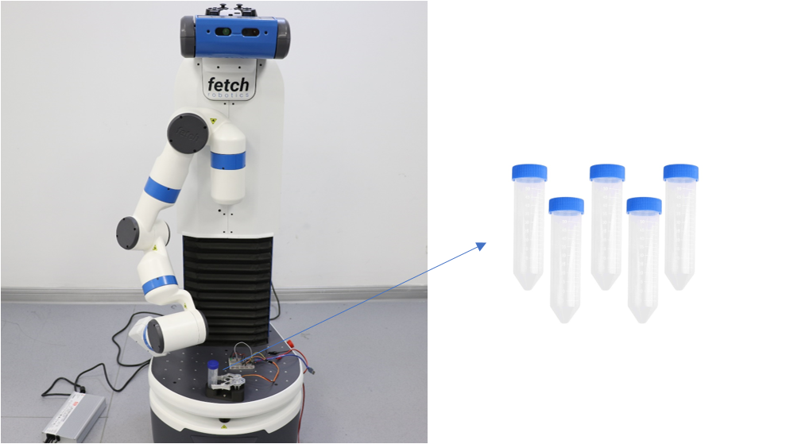
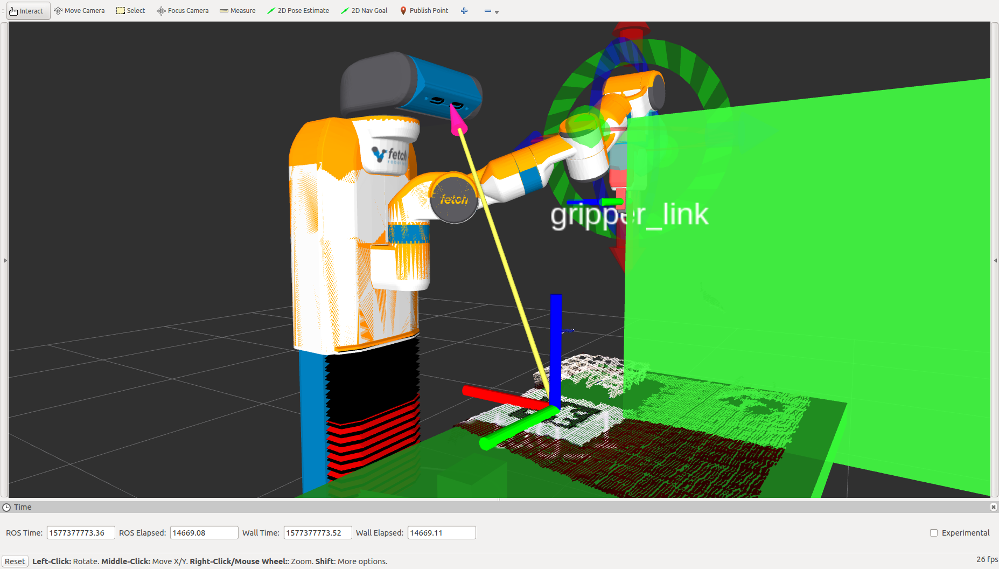

Team Name: LifeRobot  

Members:  
Yizheng Zhang: zhangyzh1@shanghaitech.edu.cn   ID: 2018233135  
Jiahui  Zhu: zhujh1@shanghaitech.edu.cn      ID: 2018233141  

Tile

Life-science Fetch Robot for Dexterous Manipulation of Centrifuge Tubes

A project of the 2019 Robotics Course of the School of Information Science and Technology (SIST) of ShanghaiTech University

Introduction

In the field of robotics, service robots are increasingly becoming an industry hot-spot. Especially for mobile manipulation, many researchers have studied its applications and some teams are focused on the manipulator's pose estimation of grasping objects, and the other teams are working on the simultaneous localization and mapping, path planning and automatic obstacle avoidance of mobile vehicles. Very few of them explore the integrated system of mobile manipulation and only transport simple, regular objects.  Since in life science experiments, many repetitive, simple tasks can be replaced by autonomous robots. This work is aiming to apply a mobile manipulation Fetch robot to execute the dexterous manipulation of centrifuge tubes in life science laboratories. Usually, those tubes have a screw-lid so that operators need to unscrew the lid and add samples inside. In this work, we performed the experiments as follow: (a) to get an accurate centrifuge tube localization; (b) to grasp the tube from the top and place it on the base of Fetch; (c) to transport the tube from the base to the test table; (d) to unscrew the lid from the top of the centrifuge tube and drop it into a box. 

System Description

The system contains 6 components:

* MoveIt framework that is used to control the manipulator to grasp the object.

* Cartographer algorithm to build a map.

* Move base ros package that is used to navigate the robot to the target place where the object should be grasped.

* AprilTag 3 visual fiducial detection algorithm is used to obtain the object pose.

* We will design a device that can clamp for test tubes on the robot.

* Rosserial package is used to communicate between arduino and the robot.

Hardware

Fig.1: Fetch robot with the fixture and centrifuge tubes with screw lids. The fixture of the centrifuge tube contains two parts, a clamping part, and a fixed part. The gripper is controlled by the servo using ardunio.

Simulator

Fig.2: Fetch robot in Rviz. We add the table as the collision.

The Demo of Experiments

How to Reproduce the Project:

cd catkin_indigo_ws

catkin_make

roslaunch fetch_moveit_config move_group.launch

rosrun rosserial_python serial_node.py /dev/ttyUSB0

roslaunch apriltags2_ros continuous_detection.launch

roslaunch life_robot_moveit start.launch move_real_robot:=true